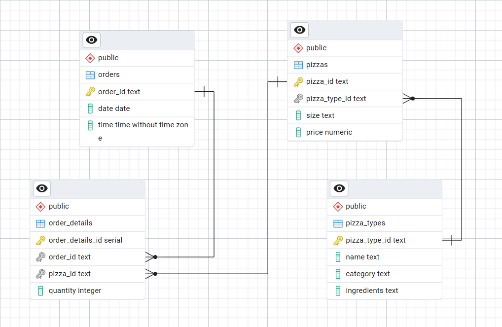

# 🍕 Pizza Sales SQL Analysis Project

This project presents a full-cycle SQL-based analysis of a pizza sales dataset using PostgreSQL. It involves importing data, cleaning it, exploring key patterns, and deriving business insights.

---

##  Project Objective

To analyze pizza sales data to uncover:
- Revenue trends
- Best-selling and least-performing pizzas
- Size and category preferences
- Performance of high vs low-priced pizzas
- Time-based ordering behaviors, etc.

---

##  4-Step Data Analysis Process

### Step 1: Data Import & Setup
-  Created database and tables (`CREATE TABLE`)
-  Defined foreign key relationships
-  Imported CSV files into PostgreSQL using `COPY` command

**Tables Used:**
- `orders` – customer order timestamps
- `order_details` – pizza quantity and mapping to each order
- `pizzas` – prices, sizes, and pizza IDs
- `pizza_types` – name, category, and ingredients

### Entity Relationship Diagram


**Data Source:**
[Dataset](https://github.com/AdityaAgarwal1602/sql_pizza_sales_analysis/tree/main/dataset)

**Query:**
```sql
-- Create Database

CREATE DATABASE pizza_sales;

-- Create Tables

CREATE TABLE pizza_types (
    pizza_type_id TEXT PRIMARY KEY,
    name TEXT,
    category TEXT,
    ingredients TEXT
);

CREATE TABLE pizzas (
    pizza_id TEXT PRIMARY KEY,
    pizza_type_id TEXT,
    size TEXT,
    price NUMERIC,
    FOREIGN KEY (pizza_type_id) REFERENCES pizza_types(pizza_type_id)
);

CREATE TABLE orders (
    order_id TEXT PRIMARY KEY,
    date DATE,
    time TIME
);

CREATE TABLE order_details (
    order_details_id SERIAL PRIMARY KEY,
    order_id TEXT,
    pizza_id TEXT,
    quantity INT,
    FOREIGN KEY (order_id) REFERENCES orders(order_id),
    FOREIGN KEY (pizza_id) REFERENCES pizzas(pizza_id)
);

-- Importing Data

COPY orders FROM 'D:\orders.csv' DELIMITER ',' CSV HEADER;
COPY order_details FROM 'D:\order_details.csv' DELIMITER ',' CSV HEADER;
COPY pizzas FROM 'D:\pizzas.csv' DELIMITER ',' CSV HEADER;
COPY pizza_types FROM 'D:\pizza_types_utf8.csv' DELIMITER ',' CSV HEADER;
```

###  Step 2: Data Cleaning
- Checked for `NULL` or missing values in all tables
- Standardized pizza size entries (`l` → `L`) using `UPPER()`
- Verified data types and ensured relational consistency using foreign keys

**Query:**
```sql
-- Check for NULLs in Each Table

SELECT * FROM orders WHERE date IS NULL OR time IS NULL;

SELECT * FROM order_details WHERE pizza_id IS NULL OR quantity IS NULL;

SELECT * FROM pizzas WHERE pizza_type_id IS NULL OR size IS NULL OR price IS NULL;

SELECT * FROM pizza_types WHERE name IS NULL OR category IS NULL;

-- Standardize Pizza Sizes (e.g., "l"-->"L")

SELECT DISTINCT size FROM pizzas;

-- Convert to upper case
UPDATE pizzas
SET size = UPPER(size);
```
### Step 3: Data Exploration
- Counted rows, viewed unique pizza sizes and categories
- Displayed distinct pizza types, table relationships, and value ranges

**Query:**
```sql
-- View all the tables
SELECT * FROM orders;
SELECT * FROM order_details;
SELECT * FROM pizzas;
SELECT * FROM pizza_types;

-- View Table names and row counts
SELECT 'orders' AS table_name, COUNT(*) FROM orders
UNION
SELECT 'order_details', COUNT(*) FROM order_details
UNION
SELECT 'pizzas', COUNT(*) FROM pizzas
UNION
SELECT 'pizza_types', COUNT(*) FROM pizza_types;

-- View distinct pizza sizes
SELECT DISTINCT size FROM pizzas;

-- View distinct categories of pizza
SELECT DISTINCT category FROM pizza_types;

-- View all distinct pizza types
SELECT DISTINCT name FROM pizza_types;
```

### Step 4: Business Analysis & Insights
- Defined solutions to key business problems
- Discover Trends and Patterns to make right business decisions

**Some Example Queries:**
```sql
-- What is the total revenue generated?
SELECT SUM(o.quantity*p.price) AS total_revenue
FROM order_details AS o
JOIN pizzas AS p
ON o.pizza_id=p.pizza_id;

-- What are the top 5 best-selling pizzas?
SELECT pt.name, COUNT(o.order_details_id) AS count
FROM order_details AS o
JOIN pizzas AS p
ON o.pizza_id=p.pizza_id
JOIN pizza_types AS pt
ON pt.pizza_type_id=p.pizza_type_id
GROUP BY pt.name
ORDER BY count DESC LIMIT 5;

-- What is the average order value?
SELECT ROUND(AVG(o.quantity*p.price),2) AS avg_order_value
FROM order_details AS o
JOIN pizzas AS p
ON o.pizza_id=p.pizza_id;

-- What is the revenue contribution by each pizza category?
SELECT pt.category, SUM(o.quantity*p.price) AS contribution,
ROUND(
    SUM(o.quantity * p.price) * 100.0 / 
    SUM(SUM(o.quantity * p.price)) OVER (), 
    2
  ) AS contribution_percent
FROM order_details AS o
JOIN pizzas AS p
ON o.pizza_id=p.pizza_id
JOIN pizza_types AS pt
ON pt.pizza_type_id=p.pizza_type_id
GROUP BY pt.category
ORDER BY contribution DESC;

-- What is the hourly order distribution?
SELECT EXTRACT(HOUR FROM time) AS hour, COUNT(order_id) AS sales_count
FROM orders
GROUP BY hour
ORDER BY sales_count DESC;

-- What is the average revenue per order?
SELECT ROUND(SUM(od.quantity * p.price) / COUNT(DISTINCT o.order_id), 2) AS avg_order_revenue
FROM orders o
JOIN order_details od 
ON o.order_id = od.order_id
JOIN pizzas p 
ON p.pizza_id = od.pizza_id;

-- Which day of the week brings in the most revenue?
SELECT TO_CHAR(o.date, 'Day') AS day, SUM(od.quantity*p.price) AS total_revenue
FROM orders AS o
JOIN order_details AS od
ON o.order_id=od.order_id
JOIN pizzas AS p
ON p.pizza_id=od.pizza_id
GROUP BY day
ORDER BY total_revenue DESC LIMIT 1;

-- Which pizza type and size combination generates the highest revenue?
SELECT pt.pizza_type_id, p.size, ROUND(SUM(o.quantity*p.price),2) AS total_revenue
FROM order_details AS o
JOIN pizzas AS p
ON o.pizza_id=p.pizza_id
JOIN pizza_types AS pt
ON pt.pizza_type_id=p.pizza_type_id
GROUP BY pt.pizza_type_id, p.size
ORDER BY total_revenue DESC LIMIT 1;

-- What is the performance comparison between high-priced and low-priced pizzas?
WITH avg_price_details AS(
	SELECT AVG(price) AS avg_price
	FROM pizzas
)
,
pizza_price_category AS (
  SELECT 
    pizza_id,
    price,
    CASE 
      WHEN price >= avg_price_details.avg_price THEN 'High'
      ELSE 'Low'
    END AS price_category
  FROM pizzas, avg_price_details
)
, pizza_sales AS (
  SELECT 
    ppc.price_category,
    SUM(od.quantity) AS total_quantity_sold,
    ROUND(SUM(od.quantity * p.price), 2) AS total_revenue
  FROM order_details od
  JOIN pizzas p ON od.pizza_id = p.pizza_id
  JOIN pizza_price_category ppc ON p.pizza_id = ppc.pizza_id
  GROUP BY ppc.price_category
)
SELECT * FROM pizza_sales;
```
*All Queries:* 
[Link](https://github.com/AdityaAgarwal1602/sql_pizza_sales_analysis/tree/main/pizza_sales_analysis.sql)

## License

This project is licensed under the [MIT License](LICENSE) © 2025 AdityaAgarwal1602.
